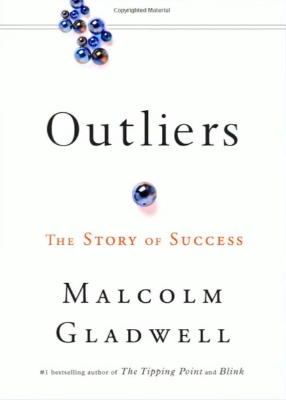
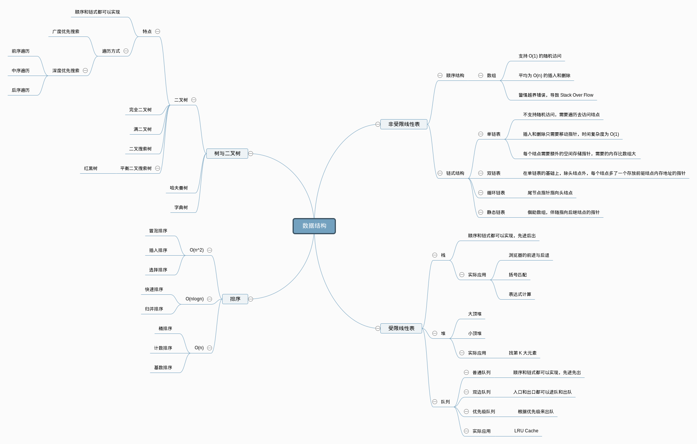
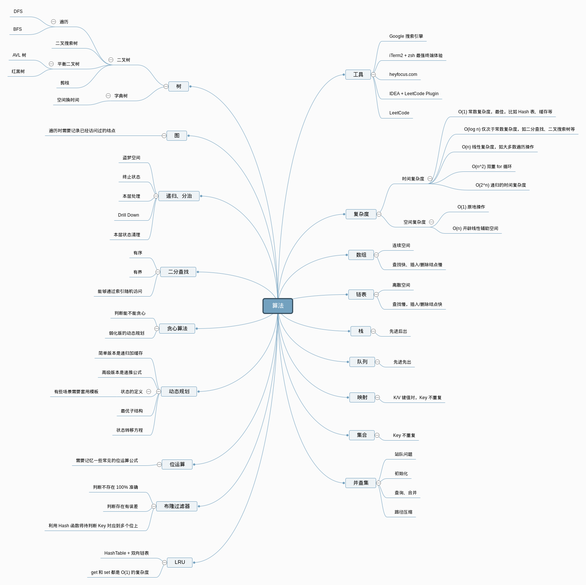

时间: 2020-11-21 17:16

***

目录

[TOC]

***

# 1. 学习方式

1. 预习
2. 课堂互动 思考题
3. 课后作业

***

# 2. 课程达到效果

1. 在数据结构的理解和运用上面达到职业顶尖水平
2. 一线互联网面试不再胆怯
3. LeetCode 300+积累

***

# 3. 课程学习方法论

来自于《Outliers》(异类：不一样的成功启示录)书中的结论：

> 如果想精通任何一个领域，主要三步：
> 	1) Chunk it up 切碎知识点
> 	2) Deliberate Practicing 可以练习
> 	3) Feedback 反馈 
> 		1] 主动反馈
> 		2] 被动反馈

***

# 4. Chunk it up

庖丁解牛
脉络连接

把比较大的，繁复的知识点切成一块一块相对比较明确的知识点。同时简单化，脉络化的知识脑图。他们必须是脉络相连的。

为什么要脉络相连呢？

引用Elon Musk的一段话，他在几个领域创业都做的很好。他在reddit上回答网友的问题：你在这么多的领域都做的这么好，到底是为什么？
他觉得任何知识体系都是一棵树，他叫做语法树。要掌握这个领域的知识的话，就要把这些知识变成一棵树状结构。有最基本的根，然后分出枝干，再分出枝叶。每个知识点最后要和自己熟悉的知识挂靠在一起，成为一个树形结构。他说人脑不适合记忆和理解孤立的知识点，所以一定要把它弄成一个脑图。

比如，大家经常玩的游戏，会分成控兵、运营、战术等等。把每一部分单独挑出来练习。这样经过很多次的不断反复练习和刻意练习之后，最后能达到顶尖水平。

本课程的算法和数据结构的知识脉络:

数据结构:
1) 一维数据结构
	1] 基础: 数组 array, 链表 linked list
	2] 高级: 栈 stack, 队列 queue, 双端队列 deque, 集合 set, 映射 map, etc

2) 二维数据结构
 	1] 基础: 树 tree, 图 graph
 	2] 高级: 二叉搜索树 binary search tree(red-black tree, AVL), 堆 heap, 并查集 disjoint set, 字典树 Trie, etc
 	
 	简单的理解: 当一个链表，它的分叉有两个的时候，它就变成了一个二维的数据结构，相当于树。高级的结构是在树的基础上加了很多的特殊判断和约定条件，比如二叉搜索树。
 	
3) 特殊数据结构
	位运算 Bitwise, 布隆过滤器 BloomFilter
 	LRU cache
 	
 	主要是用于工程中特特殊的情景。

 

算法:
1) if-else, switch --> branch
2) for, while loop --> iteration
3) 递归 Recursion(Divide & Conquer, Backtrace)
4) 搜索 Search: 深度优先搜索 Depth first search, Breadth first search, A*, etc
5) 动态规划 Dynamic Programming
6) 二分查找 Binary Search
7) 贪心 Greedy
8) 数学 Math, 几何 Geometry

 

***

# 5. Deliberate Practicing
 如果要成为顶尖水平的话，最关键的一点是所谓的基本功。
 练习基本的方式是：分解训练和反复练习

***

# 6. Feedback

主动反馈: Github Leetcode
被动反馈: code review

***

# 7. 切题四件套

1) Clarification
   	把题目分析清楚
2) Possible solutions
  	compare(time/space)
  	opotimal
3) Codeing
4) Test cases

***

**8.五遍刷题法**

第一遍: 第一次看题目，5-10分钟解题。如果没思路直接看解法
第二遍: 看完解法。背诵并默写
第三遍: 24小时后在复习
第四遍: 1周后复习
第五遍: 面试前复习

***

