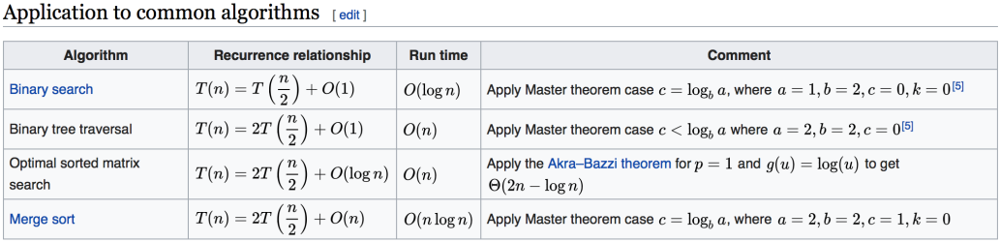

时间: 2020-11-21 22:36

***
目录

[TOC]

***

# 1. code style

1. [google code style](https://github.com/google/styleguide)
2. [alibaba code style](https://github.com/alibaba/p3c)

***

# 2. 自顶向下的编程方式

> https://markhneedham.com/blog/2008/09/15/clean-code-book-review/

***

# 3. 知乎: 如何理解算法时间复杂度的表示法

> https://www.zhihu.com/question/21387264

***

# 4. 时间复杂度

表示方式: Big O notation

常见时间复杂度:
O(1): Constant Complexity 常数复杂度
O(log n): Logarithmic Complexity 对数复杂度
O(n): Liner Complexity 线性时间复杂度
O(n^2): N squre Complexity 平方
O(n^3): N Squre Complexity 立方
O(2^n): Exponential Growth 指数
O(n!): Factorial 阶乘

注意: 只看最高复杂度的运算

```java
// O(1) 
int n = 1000;
System.out.println("Hey - your input is: " + n);

// O(?)
int n = 1000;
System.out.println("Hey - your input is: " + n);
System.out.println("Hmm.. I'm doing more stuff with: " + n);
System.out.println("And more: " + n);

// O(N)
for (int i = 1; i <= n; i++) {
 System.out.println("Hey - I'm busy looking at: " + i);
}

// O(N^2)
for (int i = 1; i <= n; i++) {
	for (int j = 1; j <=n; j++) {
 		System.out.println("Hey - I'm busy looking at: " + i + " and " + j);
	}
}

// O(log(n))
for (int i = 1; i < n; i = i * 2) {
	System.out.println("Hey - I'm busy looking at: " + i);
}

// O(k^n)
int fib(int n) {
	if (n <= 2) return n;
	return fib(n - 1) + fib(n - 2);
}
```

时间复杂度曲线


在写程序的时候，一定要对自己程序的时间和空间复杂度有所了解，而且要养成习惯。写完程序后，下意识的分析时空复杂度。用最简洁的时空复杂度完成程序是顶尖职业选手的必备素养。

***

# 5. 不同时间复杂度对程序的影响

计算：1 + 2 + 3 + … + n

方法一: 从1到n循环累加                  --> O(n)
方法二: 求和公式 sum = n(n+1)/2    --> O(1)

***

# 6. 主定理



主定理是用来解决所有递归的函数怎么来计算它的时间复杂度

数学证明比较复杂: [Master theorem](https://en.wikipedia.org/wiki/Master_theorem_(analysis_of_algorithms)), [主定理](https://zh.wikipedia.org/wiki/%E4%B8%BB%E5%AE%9A%E7%90%86)

***


